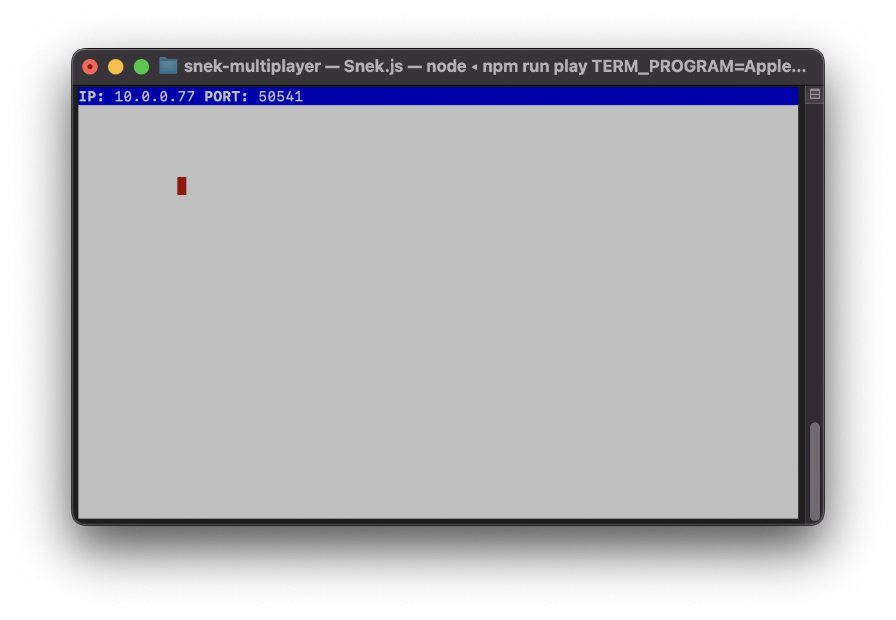
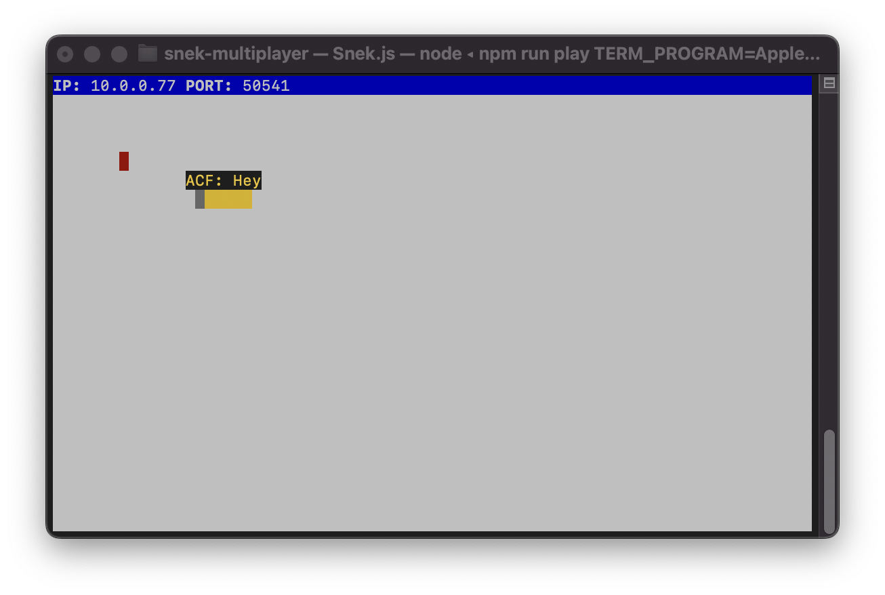
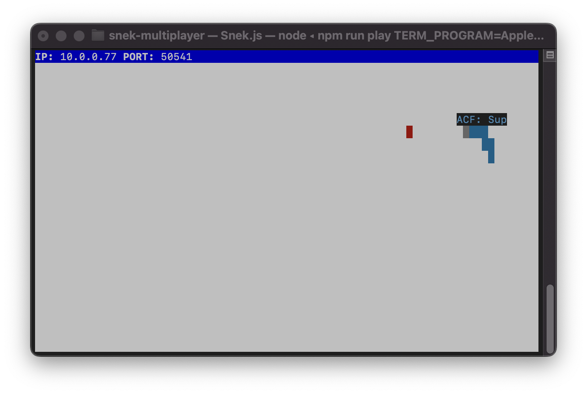
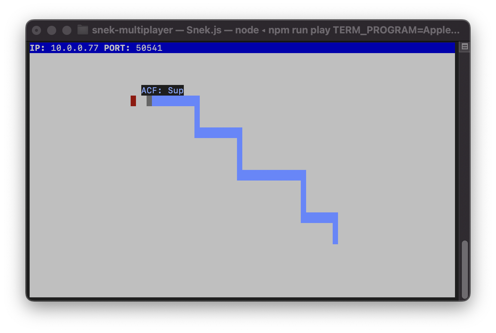

# Snake Client Project

Snake game is a very popular video game. It is a video game concept where the player maneuvers a dot and grows it by ‘eating’ pieces of food. As it moves and eats, it grows and the growing snake becomes an obstacle to smooth maneuvers. The goal is to grow it to become as big as possible without bumping into the side walls, or bumping into itself, upon which it dies.

This is simply a multiplayer take on the genre. The snake-client application has been connected to the game server and the snake has been given chat features and movements features.

Before you can run this client, you will need to be running the server side which you can download and install from here - https://github.com/lighthouse-labs/snek-multiplayer. 

## Final Product
1) `npm run play` - In the beginning there was snake food but no snake to nourish by the snek server.

2) `node play.js` + player name added - The client connected to the snek server and sent a snake to feed, grow and nourish. The snake named ACF was friendly and demonstrated it by saying Hey. 

3) W, A, S, D / UP, LEFT, DOWN, RIGHT movement while saying Sup feature added - The snake learnt how to move towards the food to feed, grow and nourish itself and learnt how to chat saying Sup; demonstrating its friendliness, once again. This is a multiplayer game after all and communication is key.

4) Now the snake competes in the game of eating food to grow and nourish itself; aspiring to be the biggest, strongest snake to ever exist in the game.

## Getting Started

- Follow steps inside the snek server repo to run the server side
- Run the development snake client using the `node play.js` command.

## Game Notes
- Snake colour changes everytime a new game is started.
- Press `control+c` to end the connection with the snek server.
- If the snake is idle the snek server kicks the player/snake out.